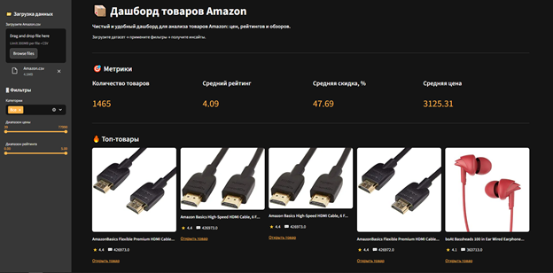
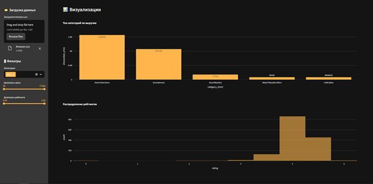
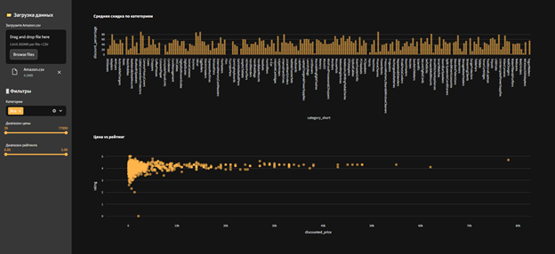
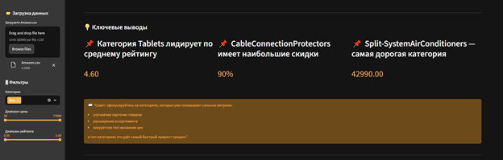

## Дашборд товаров Amazon
Интерактивный дашборд для анализа товаров Amazon: цены, рейтинги, скидки, популярность и ключевые бизнес-инсайты. Построен на **Streamlit**, **Pandas**, **Plotly**.
Ссылка на дашборд: [pompeedu-amazon-items-dashboard](pompeedu-amazon-items-dashboard.streamlit.app)

---

### Описание
Дашборд помогает быстро понять:
- Какие категории и товары приносят наибольший оборот
- Как распределяются рейтинги и скидки
- Связь цены, рейтинга и количества отзывов
- Какие категории выглядят переоценёнными или недооценёнными
- Быстро выгрузить отфильтрованные данные в CSV

### Стек и данные
- **Язык**: Python 3.9+
- **Фреймворк**: Streamlit
- **Библиотеки**: Pandas, NumPy, Plotly, Requests
- **Данные**: файл Amazon.csv (публичный датасет товаров Amazon из kaggle.com), ~10k+ товаров

---

### Быстрый старт (Streamlit)
1) Установите зависимости (при необходимости создайте venv):
```bash
pip install -r requirements.txt
```

2) Запустите приложение:
```bash
streamlit run app.py
```

3) Откройте ссылку из консоли (обычно `http://localhost:8501/`).
> Если данных нет, положите файл Amazon.csv в корень проекта — он используется в коде по умолчанию.

---

### Скриншоты дашборда
**Метрики** и **Топ товаров**:
<p align="center"></p>

**Топ категорий по выручке** и **Распределение рейтингов**:
<p align="center"></p>

**Средняя скидка по категориям** и **График цена vs рейтинг**:
<p align="center"></p>

**Матрица корреляции**:
<p align="center"></p>

**Ключевые инсайты**:
<p align="center"></p>

---

### Ключевые аналитические блоки
#### Фильтры:
- Диапазон цены
- Диапазон рейтинга
- Мультивыбор категорий (с опцией «Все»)

#### KPI-метрики:
- Количество товаров
- Средний рейтинг
- Средняя скидка
- Средняя цена

#### Визуализации:
- Топ категорий по обороту
- Распределение рейтингов
- Средняя скидка по категориям
- Цена vs рейтинг (scatter)
- Матрица корреляции

#### Выводы:
- Лидирующие категории по рейтингу, скидкам и цене
- Практические рекомендации для роста продаж

#### Структура основных функций
- load_data() — загрузка CSV с кэшированием Streamlit
- clean_numeric() — очистка и нормализация числовых данных
- apply_filters() — применение фильтров по цене, рейтингу и категориям
- is_image_available() — проверка доступности изображений товаров
- prepare_aggregations() — агрегации для метрик и графиков
- UI:
	- Основная страница с описанием
	- Sidebar с фильтрами
	- KPI-блок
	- Графики и аналитические выводы
	- Таблица данных + экспорт CSV

---

### Контакты
Telegram: [@pompeedu](https://t.me/pompeedu)  
Email: [firuzjonkurbonov735700@gmail.com](mailto:firuzjonkurbonov735700@gmail.com)
